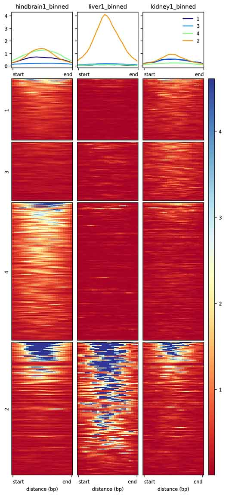
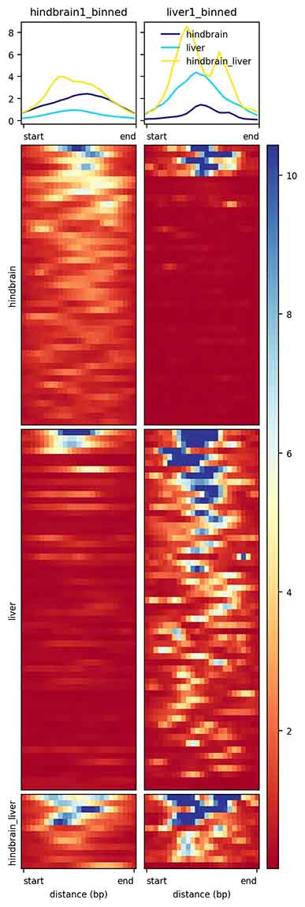
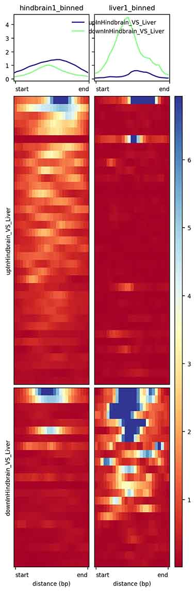

---
title: "Visualization and annotation of read signal over genomic ranges with profileplyr"
author: "Doug Barrows and Tom Carroll"
date: "`r format(Sys.Date(), '%m/%d/%Y')`"
abstract: >
  Quick and straightforward visualization of read signal over genomic intervals is key for generating hypotheses from sequencing data sets (e.g. ChIP-seq, ATAC-seq, bisulfite/methyl-seq). Many tools both inside and outside of R and Bioconductor are available to explore these types of data, and they typically start with a bigWig or BAM file and end with some representation of the signal (e.g. heatmap). profileplyr leverages many Bioconductor tools to allow for both flexibility and additional functionality in workflows that end with visualization of the read signal. Signal over select genomic intervals can be quantified with Biocondictor packages in R (e.g. [soGGi](https://bioconductor.org/packages/release/bioc/html/soGGi.html), [EnrichedHeatmap](http://bioconductor.org/packages/release/bioc/html/EnrichedHeatmap.html), [genomation](https://bioconductor.org/packages/release/bioc/html/genomation.html) or via the command line (e.g. [deepTools](https://deeptools.readthedocs.io/en/develop/index.html), [ngs.plot](https://github.com/shenlab-sinai/ngsplot)). profileplyr takes the signal quantification over ranges coming from either soGGi or deepTools, as well as the metadata associated with the ranges and the input bigWig or BAM files and stores this information in a RangedSummarizedExperiment object. profileplyr then uses this object to summarize and plot the signal within these ranges, and also to group and subset these ranges based on clustering, overlap with GRanges objects, overlap with gene lists, and genomic annotations. After manipulation with established Bioconductor tools, the profileplyr object can then be either directly visualized as a customized heatmap in R using EnrichedHeatmap or exported in a format that can be visualized with deepTools. While many users prefer to use deepTools certain steps of sequencing analysis (the handling of BAM files and utilizing computeMatrix/plotHeatmap), by staying outside of R one cannot take advantage of the many Bioconductor packages used to analyze genomic range data. The profileplyr object serves as an intermediate that can be easily manipulated and annotated using Bioconductor tools, and the integration of this object with deepTools, soGGi, and EnrichedHeatmap functions enhances the user's ability to visualize genomic signal. 

  profileplyr package version: `r packageVersion("profileplyr")`
output:
  BiocStyle::html_document:
     number_sections: yes
     toc: true
# bibliography: library.bib
vignette: >
  %\VignetteIndexEntry{Visualization and annotation of read signal over genomic ranges with profileplyr}
  %\VignetteEngine{knitr::rmarkdown}
  %\VignetteEncoding{UTF-8}
  %\usepackage[utf8]{inputenc}
---

```{r setup, echo=FALSE, results="hide"}
knitr::opts_chunk$set(tidy=FALSE, cache=FALSE,
                      dev="png",
                      message=FALSE, error=FALSE, warning=TRUE)
```	


```{r, echo=FALSE, results="hide", warning=FALSE}
library(profileplyr)
library(magrittr)
library(rtracklayer)
library(ggplot2)


data("gene_list_dataframe")

names(gene_list_dataframe)
head(gene_list_dataframe[[1]])

path_to_matrix <- system.file("extdata", "example_deepTools_MAT", package = "profileplyr")
```


# Quick start

Here we demonstrate a basic workflow starting from either a matrix output of the 'computeMatrix' function of deepTools or a soGGi ChIPprofile object, and ending with a heatmap or a boxplot to visualize the quantified signal across samples. Later in this document we will go deeper into the profileplyr object used here and the functions that can be used on this object. 

In the code below, a deepTools 'computeMatrix' output is imported as a profileplyr object. This matrix is the result of quantification of ATAC-seq signal over highly variable peaks across various tissues. The following actions are then performed on this object: 1) subset to include only the hindbrain and liver samples, 2) annotate with genes using [ChIPseeker](https://www.bioconductor.org/packages/release/bioc/html/ChIPseeker.html), 3) group by range overlap with these gene annotations based on expression in hindbrain or liver, and 4) output as a deepTools matrix:
```{r, results='hide', fig.keep="none"}
proplyrObject <- import_deepToolsMat(path_to_matrix)
proplyrObject <- proplyrObject[, , c(1:2)]
proplyrObject <- annotateRanges(proplyrObject, TxDb = "mm10") 
proplyrObject <- groupBy(proplyrObject, group = gene_list_dataframe)
export_deepToolsMat(proplyrObject, con = "./deepTools_export")
```
<a name="quickStartpipe"/>

The pipe function (%>%) from the magrittr package can also be used to simplify this same code:
```{r, results='hide', fig.keep="none"}
import_deepToolsMat(path_to_matrix) %>%
  .[ , , c(1:2)] %>%
  annotateRanges(TxDb = "mm10")  %>%
  groupBy(group = gene_list_dataframe) %>% 
export_deepToolsMat(con = "./deepTools_export")
```
The output from either of the previous two code chunks can then be used to produce the following figure using the deepTools 'plotHeatmap' function.

Code from command line: 

plotHeatmap -m deepTools_export.gz -o deepTools_export.jpg --startLabel start --endLabel end --xAxisLabel "distance (bp)"


```{r, echo=F}
unlink("deepTools_export.gz")
```


<a name="quickStartggplot"/>

Further, the signal in the ranges can be summarized with the mean (or any other summary statistic) of the entire range using the profileplyr summarize() function. This summarized signal can be visualized with ggplot (assuming the 'output' argument of summarize() is set to 'long').
```{r, results='hide', fig.keep='last'}
import_deepToolsMat(path_to_matrix) %>%
  .[, , c(1,2)] %>%
  annotateRanges(TxDb = "mm10")  %>% 
  groupBy(group = gene_list_dataframe) %>% 
  summarize(fun = rowMeans, 
            output = "long", 
            keep_all_mcols = TRUE) %>%
  ggplot(aes(x = Sample, y = log2(Signal))) + 
    geom_boxplot() + 
    facet_grid(~GLoverlap_names) + 
    scale_x_discrete(labels= c("Hindbrain", "Liver"))
```

The entire workflow can also be done in R. This is done by quantifying the signal over the ranges with soGGi (using the profileplyr function BamBigwig_to_chipProfile()), converting the resulting ChIPprofile object to a profileplyr object (using the as_profileplyr() function), manipulating and annotating the object, and finishing with either heatmap generation or summarization for plotting. Below we use the profileplyr function generateEnrichedHeatmap(), which creates and EnrichedHeatmap that automatically incorporates the features stored in the profileplyr object.

The following code chunk shows how to go from a BAM file all the way to a heatmap. The ranges used in this example are the ATAC-seq peaks with the largest signal difference in the hindbrain vs the liver, and the ranges are grouped based on overlap with genes with gene expression changes between the hindbrain and the liver. This also works with bigWigs, and in this case the 'format' argument in the BamBigwig_to_chipProfile() function needs to be set to 'bigwig'. This heatmap also shows the ease that annotation heatmaps can be added to the plot. Here we add a heatmap showing the expression change of the gene associated with each range in the hindbrain vs the liver. 

```{r, echo=FALSE}

signalFiles <- c(system.file("extdata","Sorted_Hindbrain_day_12_1_filtered.bam",package = "profileplyr"),
                 system.file("extdata","Sorted_Liver_day_12_1_filtered.bam",package = "profileplyr"))

# BAMs must be indexed
require(Rsamtools)
for (i in seq_along(signalFiles)){
  indexBam(signalFiles[i])
}

testRanges <- system.file("extdata", 
                          "newranges.bed", 
                          package = "profileplyr")
```

```{r, fig1, fig.height=7, fig.width=5, results='hide', warning=FALSE}

BamBigwig_to_chipProfile(signalFiles, 
                         testRanges, 
                         format = "bam",
                         paired=FALSE,
                         style="percentOfRegion",
                         nOfWindows=20,
                         distanceAround=40) %>% 
  as_profileplyr %>% 
  annotateRanges(TxDb = "mm10")  %>%
  groupBy(group = gene_list_dataframe) %>% 
  generateEnrichedHeatmap(extra_annotation_columns = c("hindbrain_liv_stat"),
                          sample_names = c("Hindbrain",
                                           "Liver"))

```


# Import signal quantification from deepTools or soGGi

There are two main ways to go from a bigWig of BAM file to a profileplyr object, which is a version of the *RangedSummarizedExperiment* class within the  [SummarizedExperiment](https://bioconductor.org/packages/release/bioc/html/SummarizedExperiment.html) package. A profileplyr object can be generated from the command line with the output of the deepTools 'computeMatrix' function, or from within R using the output of the soGGi regionPlot() function. 

1) [Starting with output from deepTools 'computeMatrix'](#deepToolsoutput)
2) [Starting with output from soGGi](#soGGioutput)

<a name="deepToolsoutput"/>

## Starting with output from deepTools 'computeMatrix'

If you do do not currently have deepTools installed, instructions for installation are in the [deepTools manual](https://deeptools.readthedocs.io/en/develop/content/installation.html), with the easiest method likely being through [Bioconda](https://bioconda.github.io/recipes/deeptools/README.html). 
  
This direct output from the 'computeMatrix' function can be imported into R as a profileplyr object using the import_deepToolsMat() function. This function takes as its only argument the path to the matrix from deepTools. The information contained within this matrix is stored in a profileplyr object.

```{r, warning=F}
library(profileplyr)

example <- system.file("extdata", 
                       "example_deepTools_MAT", 
                       package = "profileplyr") 
proplyrObject <- import_deepToolsMat(example) 

```

<a name="soGGioutput"/>

## Starting with output from soGGi 

The soGGi function plotRegion() allows for the quantification of signal over genomic intervals within R, and the information from this quantification is stored in a ChIPprofile object. profileplyr can take the ChIPprofile object as an input to generate a profileplyr object using the as_profileplyr() function. While the plotRegion function from soGGi does not allow for inputting multiple signal files or multiple BED files, profileplyr contains a function to do this, BamBigwig_to_ChIPprofile(). This function takes a character vector of paths to bigWig files or BAM files in the 'signalFiles' argument. Note that the files for each function call must be all BAMs or all bigWigs and not a combination of the two. The 'testRanges' argument is must be a character vector of paths to BED files. The corresponding names for each BED file that will appear on visualizations involving the resulting profileplyr object can be set with the 'testRanges_names' argument.   

```{r, warning=FALSE, message=FALSE}

signalFiles <- c(system.file("extdata","Sorted_Hindbrain_day_12_1_filtered.bam",package = "profileplyr"),
                 system.file("extdata","Sorted_Liver_day_12_1_filtered.bam",package = "profileplyr"))

# BAMs must be indexed
require(Rsamtools)
for (i in seq_along(signalFiles)){
  indexBam(signalFiles[i])
}

testRanges <- system.file("extdata", 
                          "newranges_small.bed", 
                          package = "profileplyr")

chipProfile <- BamBigwig_to_chipProfile(signalFiles, 
                         testRanges, 
                         format = "bam",
                         paired=FALSE,
                         style="percentOfRegion",
                         nOfWindows=20,
                         distanceAround=40
                         )
chipProfile
```

Once we have the ChIPprofile object, the as_profileplyr() function will generate the profileplyr object that can be used in the many downstream functions described below. Similar to when you import from deepTools, the grouping of the ranges after using the as_profileplyr() function is stored in the 'rowGroupsInUse' section of metadata(proplyrObject). Further, if the object is derived from a soGGi ChIPprofile object, the inherited group column will be called 'sgGroup'.
```{r}
proplyrObject <- as_profileplyr(chipProfile)
metadata(proplyrObject)$rowGroupsInUse
```

```{r, echo=F}
#vignette compiles much faster if going off of deeptools input
proplyrObject <- import_deepToolsMat(example)
```

# The profileplyr object

The profileplyr object is a form of the *RangedSummarizedExperiment* class, which allows us to both store all of the relevant information that is imported from soGGi or deepTools, and have flexibility in how we manipulate this object in downstream analysis. We will go through many of these features by looking at the object we just generated from the import functions. 

```{r}
proplyrObject
```
 
## Key components of the object
The matrices that represent the bigWig or BAM signal within each bin (bin size specified within deepTools, soGGi by default uses base pair resolution, so bin = 1) are contained in a list within the profileplyr object that can be accessed with the assays() function. The columns of each matrix are the bins, while the rows are the ranges from the BED files that were used as the input to deepTools or soGGi, and the dimensions of each matrix can be seen with dim(). 

```{r}
library(SummarizedExperiment)

assays(proplyrObject)
dim(proplyrObject)

```

A key feature of the *RangedSummarizedExperiment* class is the ability to link the rows of the assay matrices to genomic ranges. Those ranges are stored in a GRanges object allowing for efficient integration with other Bioconductor packages. The GRanges object within the profileplyr object can be accessed with the rowRanges() function. Standard GRanges accessor functions such as start(), end(), or ranges() can be used on the entire profileplyr object. Furthermore, as these ranges are annotated by the various functions of profileplyr, information and classifications of these ranges will be stored in this GRanges object in the metadata columns, which can be accessed as a Dataframe with the mcols() function (this same information is also contained in the rowData section of the object, accessed with rowData()).

```{r}
rowRanges(proplyrObject)[1:3]
```


The information associated with each sample is stored as a Dataframe within with the metadata of the profileplyr object, and is accessed with sampleData(). 

```{r}
sampleData(proplyrObject)
```

The 'rowGroupsInUse' accessor for the metadata indicates which column of the range metadata (mcols() or rowRanges()) that will be used for grouping in the final output if that object were used for visualization. For a profileplyr object created from a deepTools computeMatrix output or from a soGGi ChIPprofile object, the inherited groups correspond to the BED files over which the signal was quantified, and these groups are contained in the 'dpGroup' column. 
```{r}
metadata(proplyrObject)$rowGroupsInUse
```

The 'mcolToOrderBy' slot of the metadata indicates which column of the range metadata will be used for ordering the ranges as they are exported to either deepTools or to EnrichedHeatmap (with the generateEnrichedHeatmap() function within profileplyr). This can be set using the orderBy() function, which requires a profileplyr object and a character string matching a column name of the range metadata as arguments. If groupBy is never used on an object, the default will be to order by the mean signal of each range (within each group). In addition, until groupBy() has been used on a profileplyr object, the 'mcolToOrderBy' slot of the metadata will be NULL and will not be seen with metadata(proplyrObject).

NOTE: If you are exporting to deepTools and want to order by something other than mean range signal (or other [deepTools ordering options](https://deeptools.readthedocs.io/en/develop/content/tools/plotHeatmap.html)), then make sure to set the --sortRegions argument of deepTools 'plotHeatmap' to "no" so your custom ordering will be used. generateEnrichedHeatmap() will always use the column indicated by metadata(proplyrObject)$mcolToOrderBy, or the mean signal if that value is NULL. 

```{r}
metadata(proplyrObject)$mcolToOrderBy

proplyrObject <- orderBy(proplyrObject, "score")
metadata(proplyrObject)$mcolToOrderBy
```

```{r, echo=FALSE}
# change back to NULL for any other functions relying on this object
metadata(proplyrObject)$mcolToOrderBy <- NULL
```


## Subsetting the profileplyr object 

The profileplyr object can be subset either by sample, or by rows and columns of the matrix for each sample. This is done using the '[ ]' brackets, with the first position being assay matrix rows, the second position being assay matrix columns, and the third position being the entire matrix for each sample (in addition to the rest of the metadata and range data). For example if you wanted to get the first ten rows and columns of each sample matrix:

```{r}
proplyrObject[1:10,1:10]
```

The more useful subsetting functionality is likely the ability to subset by samples using the third position of the bracket. For example, if you only wanted the first two samples to export to a deepTools matrix or for further downstream analysis, you could simply just subset with the third position:

```{r}
proplyrObject[ , , 1:2]
```

<a name="changeSampleNames"/>

## Changing sample names 

It might be helpful to change the sample names to something that is shorter to make labeling of figures clearer. This can be done separately in most of the visualization packages that a profileplyr object can be used in, but you can change the names within in the sampleData it will be changed for all downstream analyses. After importing either a deepTools matrix or a soGGi object, the sample names are stored as the rownames of the sampleData Dataframe.

```{r}
rownames(sampleData(proplyrObject))
```

The names can simply be changed by reassigning the rownames of this Dataframe. 

```{r}
rownames(sampleData(proplyrObject)) <- c("Hindbrain",
                                         "Liver",
                                         "Kidney")
```

Importantly, this also changes the names of the matricies stored in the assays() section of the profileplyr object, and the names used for any output method will also be changed (e.g. deepTools, EnrichedHeatmap, ggplot)

## Connecting profileplyr functions using the pipe (%>%) operator

Code involving profileplyr objects can be made clearer using the pipe operator from the magrittr package. This is aided by the fact that the profileplyr object is both the output and input of most functions within the package. This is demonstrated in the [Quick Start](#quickStartpipe) section, as well as some of the more complex visualizations [later in this vignette](#laterPipe). The user can go all the way from importing a deepTools matrix or soGGi object, through annotation and grouping, and ending with export to either the generateEnrichedHeatmap() (shown below) or export_deepToolsMat() function

# Export/Conversion of profileplyr object for heatmap visualization of ranges

The profileplyr object allows for the flexibility to be exported to various types of visualization, both inside and outside of R. This flexibility coupled with the annotation and subsetting functions described later in this vignette provide great potential for quickly navigating through data sets. There are two main ways to visualize this data once the data is stored in a profileplyr object, first as a heatmap of signal over the individual bins within these genomic ranges (e.g. deepTools and EnrichedHeatmap), and second as summarized signal (e.g. mean of the entire range) in [ggplot](https://cran.r-project.org/web/packages/ggplot2/index.html) or clustered heatmaps (e.g. [pheatmap](https://cran.r-project.org/web/packages/pheatmap/index.html)). 

For heatmap visualization of the signal over the genomic intervals this object can be converted to:

1) [A matrix that can be used as an input for the 'plotHeatmap' function of deepTools](#export_deepToolsMat) 
2) [A heatmap containing all range grouping and annotation information (using a modified implementation of the EnrichedHeatmap constructor)](#generateEnrichedHeatmap)
3) [A list of matrices that can be used in the EnrichedHeatmap() function within R](#convertToEnrichedHeatmapMat)

<a name="export_deepToolsMat"/>

## Export to a deepTools matrix

Any profileplyr object can be exported as a matrix formatted for the deepTools 'plotHeatmap' function using the export_deepToolsMat() function. This simply requires the name of the profileplyr object and the path to the desired destination of the gzipped matrix. This function will build the metadata for the deepTools matrix based on the metadata in the profileplyr object. Importantly, the range metadata column of profileplyr object (accessed with rowRanges(object)) that is specified in the 'rowGroupsInUse' section of metadata for the whole object (found using metadata(object)$rowGroupsInUse) is automatically used to set the grouping of the exported deepTools matrix. The 'rowGroupsInUse' can be changed using the groupBy() function (see more details [below](#switchMetadataColumn)). 


```{r, eval=T, results='hide'}
export_deepToolsMat(proplyrObject, "test_output")
```

```{r, echo=F}
unlink("test_output.gz")
```


<a name="generateEnrichedHeatmap"/>

## Directly generate a customized EnrichedHeatmap with annotated ranges

To generate a heatmap within R directly from the profileplyr object, the  generateEnrichedHeatmap() function should be used. This function takes a profileplyr object and produces a heatmap using the EnrichedHeatmap package. It allows for easy export from the profileplyr object and simple inclusion of the metadata as heatmap annotations. So far the profileplyr object used in this vignette is relatively basic (no groups or additional metadata), but this function generates a multipanel heatmap with a variety of arguments that have been tailored to visualizing the profileplyr object. As we explore more functionality within profileplyr, some of these features will be demonstrated. 

By default, if the ranges are divided into multiple groups (e.g. multiple BED files were input) the heatmap will automatically be divided and annotated to reflect these groups. Here we have no groups so we can set the 'include_group_annotation' argument to be FALSE. If this were set to TRUE, then colored annotation bars would exist to the left of the heatmaps. The maximum value for the y-axis in the line plots at the top of each heatmap are also automatically set based on the highest mean range signal from all of the samples. This can be set manually with the 'ylim' argument, or if ylim = NULL, the maximum will be inferred (i.e. be different) for each individual heatmap. 

```{r, fig3, fig.height = 6, fig.width = 4}
generateEnrichedHeatmap(proplyrObject, include_group_annotation = FALSE)
```

<a name="convertToEnrichedHeatmapMat"/>

## Convert to an EnrichedHeatmap matrix

profileplyr also facilitates direct use of the EnrichedHeatmap() function within the EnrichedHeatmap package, allowing the user further flexibility in the heatmaps that can be generated from a profileplyr object.EnrichedHeatmap uses a special type of matrix of the 'normalizedMatrix' class to generate heatmaps. The convertToEnrichedHeatmapMat() function within profileplyr takes a profileplyr object as the only required input, and then converts the matrices contained within the assays slot to a list of 'normalizedMatrix' class objects that can be used in the EnrichedHeatmap() function. See the [EnrichedHeatmap](http://www.bioconductor.org/packages/devel/bioc/vignettes/EnrichedHeatmap/inst/doc/EnrichedHeatmap.html#toc_10) vignette for detailed examples for how heatmaps can be concatenated together to visualize all of the data in one figure. Importantly, the metadata stored in the rowRanges slot of the profileplyr object can also be utilized to annotate these heatmaps. NOTE: While this function provides the most flexibility for the user to build a custom set of heatmaps, a more useful function for quick visualization of data stored in a profileplyr object is the generateEnrichedHeatmap() function, which builds these heatmaps with one command using the profileplyr object (see the previous section).

```{r, fig2, fig.height=8, fig.width=4, results='hide', fig.keep='none'}
library(EnrichedHeatmap)
EH_mat <- convertToEnrichedHeatmapMat(proplyrObject)
EH_mat[[1]]

# the matricies of this list can be inputs for EnrichedHeatmap()
```


# Summarize signal for ggplot or heatmap visualization

Oftentimes it will be important to use some kind of summary statistic for the entire range when trying to understand and visualize differences between samples. This is often going to be done using the summarize() function. The summarize function requires the name of a profileplyr object, the function used to summarize the ranges (e.g. rowMeans or rowMax), and the type of output. Here the basic options will be demonstrated with the example data which contains no groups, however, note how it is used [later](#ggplotGroups) in the vignette or in the [quick start](#quickStartggplot) when additional grouping options are discussed and summarizing the data in this way becomes especially useful. 


## Matrix output for heatmaps  

If the 'output' argument is set to 'matrix', then only a matrix will be returned with a single column for each sample containing the bins summarized as indicated with the 'fun' argument. The row names of this matrix is a unique identifier for each range containing the chromosome, start, end, and group. 

```{r}
object_sumMat <- summarize(proplyrObject, 
                           fun = rowMeans, 
                           output = "matrix") 
object_sumMat[1:3, ]
```

This matrix can be used directly in other heatmap generating packages, including pheatmap.

```{r, fig4, fig.height=5, fig.width=5}
library(pheatmap)
pheatmap(object_sumMat, 
         scale = "row", 
         show_rownames = FALSE)
```

## Long output for ggplot 

If the 'output' argument is set to 'long', then the output will be a long data frame that can be used for plotting with ggplot. The grouping column of the range metadata as specified by 'metadata(proplyrObject)$rowGroupsInUse' will automatically be included in the data frame. If the other range metadata columns should be included in the data frame, then the 'keep_all_mcols' argument should be set to TRUE. Additionally, columns specifying the range, as well as the sample and the summarized signal that correspond to that range are included by default.

```{r}
proplyrObject_long <- summarize(proplyrObject, 
                                fun = rowMeans, 
                                output = "long") 
proplyrObject_long[1:3, ]
```

This data frame can then be used directly with ggplot for plotting. 

It is often helpful to log transform the signal to more clearly see trends in the signal that is quantified. 
```{r, fig15, fig.height=4, fig.width=4, fig.align='center'}
ggplot(proplyrObject_long, aes(x = Sample, y = log(Signal))) + 
       geom_boxplot()

```

## profileplyr object output with summarized matrix

Lastly, if the 'output' argument is set to 'object', then a profileplyr object containing the summarized matrix will be returned. This will allow for further grouping or manipulation of the summarized ranges with other profileplyr functions, as opposed to using the binned ranges that are often used in the examples below. 

```{r, results='hide'}
proplyrObject_summ <- summarize(proplyrObject, 
                                fun = rowMeans, 
                                output = "object")
```
```{r}
assays(proplyrObject_summ)[[1]][1:3, ]
rowRanges(proplyrObject_summ)[1:3]
```

# Annotating of genomic ranges with clusters, genomic regions, and genes

## K-means and hierarchical clustering of the genomic ranges

Clustering of the signal across the genomic intervals of interest can shed light on patterns that aren't immediately apparent when looking at the data as a whole. The clusterRanges() function provides a framework to cluster ranges that are contained in a profileplyr object. It should be noted that clustering can also be performed outside of R within the deepTools 'plotHeatmap' function, however, profileplyr clustering allows for integration of this clustering with further grouping mechanisms and visualizations within R and profileplyr. 

clusterRanges() takes a profileplyr object as its first argument as well as a function to summarize the signal in each range (similar to the summarize() function above). The pheatmap package is then used to cluster the ranges, and the type of clustering depends on whether the user inputs a value for 'kmeans_k' (for kmeans clustering) or 'cutree_rows' (for hierarchical clustering using hclust). An integer value entered for either of these arguments will specify the number of clusters used for each method. If both 'kmeans_k' or 'cutree_rows' are left as NULL (default), then a heatmap will be printed with hierarchical clustering, but no distinct clusters defined, and no profileplyr object will be returned. This might be helpful as an initial and quick look at the ranges or as a means to determine the number of clusters to try. 

```{r, fig5, fig.height=6, fig.width=6, results='hide', fig.keep='none'}
clusterRanges(proplyrObject, 
              fun = rowMeans)

# this code prints heatmap (does not return), but heatmap not shown here to save space
```

If an integer is entered for either 'kmeans_k' or 'cutree_rows', then a profileplyr object will be returned with a cluster assigned to each range, and a column is added to the range metadata with the cluster for each range. Further, the 'rowGroupsInUse' is changed to this column, meaning that if this object is exported as a deepTools matrix with the export_deepToolsMat() function, the heatmap generated by 'plotHeatmap' will be grouped by the clusters. 

```{r, fig6, fig.height=6, fig.width=6}
set.seed(0)
kmeans <- clusterRanges(proplyrObject, 
                        fun = rowMeans, 
                        kmeans_k = 4)

rowRanges(kmeans)[1:3]

metadata(kmeans)$rowGroupsInUse
```

To visually inspect the clusters, the heatmap can also be printed (though it will not be returned) if the 'silent' argument is set to FALSE. A profileplyr object will still be returned even if silent is set to FALSE. 

**Kmeans clustering:**
```{r, fig7, fig.height=5, fig.width=5.5}
set.seed(0)
kmeans <- clusterRanges(proplyrObject, 
                        fun = rowMeans, 
                        kmeans_k = 4, 
                        silent = FALSE)
```

**Hierarchical Clustering:**
```{r, fig8, fig.height=5, fig.width=5}
hclust <- clusterRanges(proplyrObject, 
                        fun = rowMeans, 
                        cutree_rows = 4, 
                        silent = FALSE)
```


## Output matrix with cluster information to deepTools

The profileplyr object that is the output of clusterRanges() can be exported as a deepTools matrix, which can then be used as an input for plotHeatmap. 
```{r, results='hide'}
export_deepToolsMat(kmeans, "kmeans_cluster_mat")
```

```{r, echo=F}
unlink("kmeans_cluster_mat.gz")
```

This matrix can then be passed directly to 'plotHeatmap', either by using the terminal or by using the system() function in R.

Code from command line :

plotHeatmap -m kmeans_cluster_mat.gz -o kmeans_cluster_mat.jpg --startLabel start --endLabel end --xAxisLabel "distance (bp)"



## Generate group-annotated heatmap in R directly with generateEnrichedHeatmap()

After clustering the profileplyr object can be passed directly as an argument into the generateEnrichedHeatmap() function, and by default the heatmap will be grouped and annotated by these clusters, which were automatically set as the 'rowGroupsInUse' in the clusterRanges() function. Assuming that the 'include_group_annotation' argument of this function is set to the default value of TRUE, whichever metadata column is set to the 'rowGroupsInUse' slot will be used for the grouping and annotation seen below. 

```{r, fig9, fig.height=6, fig.width=4}
generateEnrichedHeatmap(kmeans)
```

<a name="ggplotGroups"/>

## Visualize mean range signal for each cluster with ggplot

An alternative way to visualize the clusters is by summarizing the signal over each range and then plotting those means by cluster. The flexibility with grouping and annotating within profileplyr makes this relatively easy. This is also a good demonstration of using piped code, going all the way from import to clustering, then to summarizing by mean range signal, and finishing with ggplot visualization:
```{r, results='hide', fig.align="center"}
library(magrittr)

set.seed(0)
import_deepToolsMat(example) %>%
  clusterRanges(fun = rowMeans, 
                kmeans_k = 4, 
                silent = TRUE) %>% 
  summarize(fun = rowMeans, 
            output = "long") %>% 
  ggplot(aes(x = Sample, y = log(Signal))) + 
         geom_boxplot() + 
         facet_grid(~cluster) + 
         theme(axis.text.x = element_text(angle = 90, hjust = 1)) + 
         scale_x_discrete(labels= c("Hindbrain", "Liver", "Kidney"))
```

## Gene annotation of ranges 

Understanding the genes that are in the proximity to a particular set of ranges allows for potential understanding of functional consequences of signal patterns within these ranges. By annotating the ranges within a profileplyr object with genes, the user can connect signal of particular samples to specific genes and the functions attributed to those genes. profileplyr provides two methods of annotating the ranges within the object using two established Bioconductor packages, [ChIPseeker](http://bioconductor.org/packages/release/bioc/html/ChIPseeker.html) and [rGREAT](https://bioconductor.org/packages/release/bioc/html/rGREAT.html). 

### Annotation of ranges with genes and genomic regions using ChIPseeker

The annotateRanges() function passes the ranges of a profileplyr object to the annotatePeak() function of ChIPseeker, and then integrates the information from this output into the profileplyr object. The annotation of the ranges, including the annotation type (promoter, exon, etc) and closest gene, are then compiled in the range metadata. In addition to the profileplyr object, a TxDb object must be specified with the 'TxDb' argument. The TxDb argument can be one of three things:

1) a character string that is either "hg19", "hg38", "mm9", or "mm10", which will automatically retrieve the relevant TxDb object
2) a TxDb object
3) a character string that is a path to a GTF or GFF file, in which case a TxDb object will be made using the makeTxDbFromGFF() function from the [Genomic Features](http://bioconductor.org/packages/release/bioc/html/GenomicFeatures.html) package. 

Note that the default action of this function will not change the 'rowGroupsInUse' slot of the metadata. However, if changeGroupToAnnotation = TRUE, a newly generated metadata column will be added that combines the inherited grouping of the ranges and the genomic annotation that was determined by ChIPseeker. If this object is exported as a deepTools matrix, the heatmap will group the ranges first by the inherited grouping, followed by the annotation groups (e.g. promoter, intron, etc). This can be modified by setting the 'heatmap_grouping' argument to 'annotation', which will force the ranges to be grouped first by annotation, followed by the inherited grouping. 

```{r}
anno <- annotateRanges(proplyrObject, 
                       TxDb = "mm10")
rowRanges(anno)[1:3]
```

Lastly, if only a subset of annotation types are desired (e.g. just those ranges within promoters) then the 'annotation_subset' argument can be used and the profileplyr object will be subset accordingly.

#### Adding metadata information beyond the grouping column to the EnrichedHeatmap

The EnrichedHeatmap package brings a lot of heatmap annotation options, and the profileplyr generateEnrichedHeatmap() function takes advantage of this by giving the user the ability to add both categorical and numeric annotations on the right side of the matrix heatmaps. For example, the ChIPseeker annotations added to the range metadata in the previous example can be visualized. Adding metadata columns is done using the 'extra_annotation_columns' argument of generateEnrichedHeatmap(). This argument takes a character vector with strings that match column names in the range metadata, with no limit on the number of columns that can be visualized. Doing this below, it immediately becomes clear that many of the ranges with the highest signal are in promoters, which is expected for ATAC-seq signal. 

```{r, fig10, fig.height=6, fig.width=4.5}
generateEnrichedHeatmap(anno, 
                        extra_annotation_columns = "annotation_short",
                        include_group_annotation = FALSE)
```


In addition to being exported to a deepTools matrix or Enrichedheatmap, these annotations from annotateRanges() can be further utilized with the groupBy() function, discussed below. 

```{r, echo=FALSE}
# subset object to speed up demonstration
proplyrObject <- proplyrObject[1:5, , ]
```

### Annotation of ranges with genes using GREAT

Another common method of annotating genomic intervals with nearby genes is by using the [GREAT](https://bioconductor.org/packages/release/bioc/html/rGREAT.html) method, which defines regulatory regions for each gene and then determines whether a certain genomic interval overlaps with that genic regulatory region. The profileplyr function annotateRanges_great() takes a profileplyr object and the genome that is to be used for the annotation, and will add a column to the range metadata to indicate whether that range overlaps with the regulatory region of a gene. If a region is in regulatory regions of multiple genes, then it will have multiple rows within the profileplyr object. This function will not change the grouping of the profileplyr object. 

```{r, fig.keep="none"}

anno_great <- annotateRanges_great(proplyrObject, 
                                   species = "mm10")
rowRanges(anno_great)[1:3]
```

# Grouping ranges by range metadata, gene list, or additional GRanges

The groupBy() function within profileplyr allows for a range of grouping mechanisms. The groupBy() function always requires a profileplyr object and the 'group' argument, which will determine how the ranges are to be grouped. There are three options for grouping:

1) [Switch output grouping columns within existing range metadata](#switchMetadataColumn)
2) [Group by user-supplied GRanges](#groupByGRanges)
3) [Group by user-supplied gene list](#groupBygenelist)

<a name="switchMetadataColumn"/>

## Switch output grouping columns within existing range metadata

If the 'group' argument is a character string then it must match a name of one of the columns in mcols(proplyrObject). In this case the groupBy function will change the column that will be used for grouping a profileplyr object during visualization. While many of the profileplyr functions shown above will set the grouping column (specified in the 'rowGroupsInUse' section of metadata(proplyrObject)) to the appropriate column for that function, the user may want to use another column for the grouping of the deepTools matrix to be output. The user may have added an additional column to the range metadata that can be used, or a column that is generated in one of the above functions, but is not the default grouping column, might be useful. For example, the default grouping for the annotateRanges() function is a combination of the inherited groups and the annotations, however, maybe the user wants to disregard the inherited grouping of ranges and group all of the ranges by the new annotation. In this case they would change the grouping to the 'annotation_short' column, as shown below.  

```{r, results='hide'}
anno <- annotateRanges(proplyrObject,
                       TxDb = "mm10")
```
```{r}
metadata(anno)$rowGroupsInUse

anno_switchGroup <- groupBy(anno, 
                            group = "annotation_short")
metadata(anno_switchGroup)$rowGroupsInUse
```

```{r, echo=F}
# reload full object with all ranges
proplyrObject <- import_deepToolsMat(example)
rownames(sampleData(proplyrObject)) <- c("Hindbrain",
                                         "Liver",
                                         "Kidney")
```

<a name="groupByGRanges"/>

## Group by user-supplied GRanges

If the 'group' argument is a GRanges or a GRangesList then the overlap between each GRanges in this list and the ranges of the profileplyr object will be determined. A column will be added to the range metadata (column name is 'group_and_overlap') that shows a combination of the inherited group and whether the range overlaps with any of the GRanges. The 'rowGroupsInUse' will be changed to this column by default. If the inherit_groups argument is set to FALSE, then only the overlaps with the GRanges will determine the grouping. 

One consideration with this function is what should be done with ranges that overlap multiple GRanges. The default behavior of this function is to duplicate the range and place it in each overlap group for each GRanges. If separateDuplicated = TRUE, then separate groups will be generated for the ranges that overlap multiple GRanges so that every range is in the resulting profileplyr object exactly once. This option is discouraged with high numbers of input GRanges, as the combinations of overlapping groups can get quite large. Lastly, the non-overlapping regions can be included in the heatmap if the 'include_nonoverlapping' argument is set to TRUE. 

Here we import BED files containing the top 5000 H3K27ac peaks from [hindbrain](https://www.encodeproject.org/files/ENCFF409CQX/) and [liver](https://www.encodeproject.org/files/ENCFF538RYO/) using the rtracklayer package. These peaks sets were adapted from BED files that were downloaded from ENCODE using the provided links. The GRanges are then combined into a GRangesList to be used in the 'group' argument for the groupBy() function.  
```{r, results='hide'}
library(rtracklayer)

# import bed files as GRanges
hindbrain_K27ac <- import.bed(system.file("extdata", 
                                          "K27ac_hindbrain_top5000.bed", 
                                          package = "profileplyr") )
liver_K27ac <- import.bed(system.file("extdata", 
                                      "K27ac_liver_top5000.bed", 
                                      package = "profileplyr") )
# make GRangesList
K27ac_GRlist <- GRangesList(hindbrain_K27ac, 
                            liver_K27ac)
K27ac_GRlist_names <- c("hindbrain_K27ac", 
                        "liver_K27ac")

# subset the profileplyr object to just hindbrain and liver, 
# and group by GRanges
K27ac_groupByGR <- proplyrObject[,,grepl("Hindbrain|Liver", 
                                         names(assays(proplyrObject)))] %>%
                   groupBy(group = K27ac_GRlist,
                           GRanges_names = K27ac_GRlist_names, 
                           include_nonoverlapping = FALSE,
                           inherit_groups = FALSE)
```
```{r}
rowRanges(K27ac_groupByGR)[1:3]

```

As with any profileplyr object, this can be exported to deepTools 'plotHeatmap' using the profileplyr function export_deepToolsMat()

```{r, results='hide'}
export_deepToolsMat(K27ac_groupByGR, 
                    con = "K27ac_GRoverlap.gz")
```

```{r, echo=F}
unlink("K27ac_GRoverlap.gz")
```

This matrix can then be passed directly to 'plotHeatmap', either by using the terminal or by using the system() function in R. 

Code from command line:

plotHeatmap -m K27ac_GRoverlap.gz -o K27ac_GRoverlap.jpg --startLabel start --endLabel end --xAxisLabel "distance (bp)"



The profileplyr object can also be passed directly to the generateEnrichedHeatmap() function to be visualized in R with the following command:

> generateEnrichedHeatmap(K27ac_groupByGR)


<a name="groupBygenelist"/>

## Group by user-supplied gene list

If the 'group' argument is a list (i.e. class(group) returns "list"), then it is assumed that this list contains lists of gene sets. These gene sets within this list can either be character vectors of gene symbols, or data frames with the gene symbols as rownames. Importantly, if all of the elements of the list are data frames AND they all have the same columns (as determined by having matching column names), then those columns will be added to the range metadata to potentially be used to annotate the ranges. This is especially useful for annotating the ranges with additional gene-level metadata (e.g. gene expression). However, if any of the elements of the list are character vectors, or if they are data frames with columns that are different, then the additional columns will not be included in the range metadata and only the overlap information will be stored. 

The gene symbols will be used to determine overlap with the genes that are associated with each range of the profileplyr object. This type of grouping will typically follow one of the annotation functions: annotateRanges() or annotateRanges_great(). The names of the list elements (names(list)) will be used as the names of each set of genes in the range metadata and any exported deepTools matrix. A new column will be added to the range metadata that shows a combination of the inherited group and whether the range overlaps with any of the gene sets. 

### Gene set list contains a character data

First we read in a list of gene sets that are character vectors. This list contains the top 1000 differentially expressed genes that are higher in the liver compared to hindbrain, and the top 1000 that are higher in the hindbrain compared to the liver.
```{r}
data("gene_list_character")

names(gene_list_character)
head(gene_list_character[[1]])
```


Then we subset the profileplyr object to only include the signal data for hindbrain and liver. This is followed by gene annotation of these ranges using the 'annotateRanges' function which utilizes the ChIPseeker package. This can also be done with the 'annotateRanges_great' function, which uses the rGREAT package for annotation. The resulting profileplyr object has range metadata columns that have gene annotation ('SYMBOL' column) and a column with the gene set that each range overlapped combined with the inherited grouping ('group_and_overlap' column). 
```{r}
proplyrObject_HB_Liv <- proplyrObject[ , , grepl("Hindbrain|Liver", 
                                                 names(assays(proplyrObject)))]
```
```{r, results='hide', fig.keep="none"}
proplyrObject_HB_Liv <- annotateRanges(proplyrObject_HB_Liv, 
                                       TxDb = "mm10") 

proplyrObject_HB_Liv <- groupBy(proplyrObject_HB_Liv, 
                                group = gene_list_character)
```
```{r}
rowRanges(proplyrObject_HB_Liv)[1:3]
```

We can export this to deepTools:
```{r, results='hide'}
export_deepToolsMat(proplyrObject_HB_Liv, 
                    con = "groupByGene_HB_Liv")
```

```{r, echo=F}
unlink("groupByGene_HB_Liv.gz")
```

This matrix can then be passed directly to 'plotHeatmap', either by using the terminal or by using the system() function in R . 
Code from command line: 

plotHeatmap -m groupByGene_HB_Liv.gz -o groupByGene_HB_Liv.jpg --startLabel start --endLabel end --xAxisLabel "distance (bp)"




### Gene set list with data frames for heatmap annotation (using pipe - %>%)

This time we will use the same list of genes as before, but this time they are in data frames with a column containing gene expression changes for hindbrain vs liver (they are values from the 'stat' column of a [DESeq2](https://bioconductor.org/packages/release/bioc/html/DESeq2.html) results table). This allows us to add a heatmap to our visualization showing these expression changes. Also note that the generateEnrichedHeatmap() function gives the ability to manually change the sample names (previously we had shortened them by changing the rownames of sampleData(proplyrObject)) 


```{r,message=FALSE}
data("gene_list_dataframe")
names(gene_list_dataframe)
head(gene_list_dataframe[[1]])

example <- system.file("extdata", 
                       "example_deepTools_MAT", 
                       package = "profileplyr")
```

```{r, fig12, fig.height=7, fig.width=5, results='hide', fig.keep="last"}
# NOTE: could also use BamBigwig_to_chipProfile() and as_profileplyr()
# within R to start from bigwig/BAM and BED file. 

import_deepToolsMat(example) %>%
  .[ , , grepl("hindbrain|liver", names(assays(.)))] %>%
  annotateRanges(TxDb = "mm10") %>%
  groupBy(group = gene_list_dataframe,
          inherit_groups = FALSE) %>%
  generateEnrichedHeatmap(extra_annotation_columns="hindbrain_liv_stat",
                          sample_names = c("Hindbrain", 
                                           "Liver"),
                          extra_anno_width = 8)
  
```

<a name="laterPipe"/>

# Combining multiple profileplyr functions for heatmap annotation 

As a demonstration, we can combine many of the profileplyr functions and visualize more than one metadata column. From this figure we can see a number of interesting things from the data. Many of the regions with the highest ATAC-seq signal are in promoters for all clusters (the 'annotation_short' column). Cluster 2 appears to have many ranges with specific signal in the liver sample which is supported by the main heatmap, the high density of top liver K27ac peaks (red signal in the 'GRoverlap_names' column), and the high density of genes that have reduced gene expression in the liver vs the hindbrain (red signal in the 'stat' column). On the other hand Cluster 1 has specific hindbrain peaks, high overlap with hindbrain K27ac peaks, and higher expression of genes that have higher expression in the hindbrain. By extracting all of this information from the profileplyr object and displaying in a heatmap with one command, a lot can be gleaned from these data.    
 
The generateEnrichedHeatmap() function also allows for a great deal of customization of the heatmap that is built around the profileplyr object. Notice that in the heatmap below we modify colors. The color of the heatmaps from the assay matrices is changed to a two color spectrum, and the colors of the annotation heatmaps were customized as well.
```{r, fig13, fig.height=8, out.width='100%', results='hide', dpi=35}
# NOTE: could also use BamBigwig_to_chipProfile() and as_profileplyr()
# within R to start from bigwig/BAM and BED file. 

set.seed(0)
import_deepToolsMat(example) %>%
  annotateRanges(TxDb = "mm10") %>% # annotate with ChIPseeker
  groupBy(group = gene_list_dataframe,
          include_nonoverlapping = TRUE,
          inherit_groups = FALSE) %>% # group by gene overlap
  groupBy(group = K27ac_GRlist,
          GRanges_names = K27ac_GRlist_names,
          include_nonoverlapping = TRUE,
          inherit_groups = FALSE) %>% # group by GRanges
  clusterRanges(kmeans_k = 3) %>%
  generateEnrichedHeatmap(extra_annotation_columns=c("annotation_short", 
                                                       "GRoverlap_names", 
                                                       "hindbrain_liv_stat"),
                          sample_names = c("Hindbrain",
                                           "Liver",
                                           "Kidney"),
                          extra_anno_width = c(5,5,8),
                          matrices_color = c("white", "red"),
                          extra_anno_color = list(NULL,
                                                  c("black",
                                                    "red", 
                                                    "green",
                                                    "white"),
                                                  c("#e7e1ef", 
                                                    "#c994c7", 
                                                    "#dd1c77")))

```
The color arguments for both the matrices and the extra annotation columns can either be a character vector if all heatmaps should have the same color scheme, or a list if each individual heatmap requires different colors. If a list is used, the list must be the same length as the number of heatmaps, and each element of the list maps to the corresponding matrix in the profileplyr object (for 'matrices_color') or to the corresponding element in the 'extra_annotation_columns' argument (for 'extra_anno_color'). If the color of a particular heatmap is to be left unchanged, then that element of the list should be NULL. 
 

# Acknowledgements

Thank you to Ji-Dung Luo for testing/vignette review/critical feedback, Elitsa Stoyanova for critical feedback/vignette review and David Allis for his support. 


# Session info

```{r sessionInfo}
sessionInfo()
```

